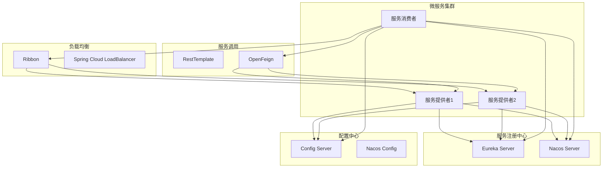
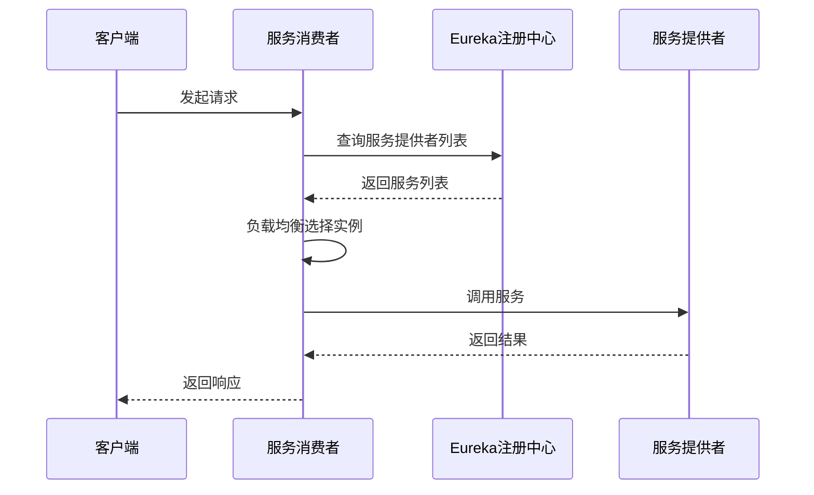

# 🌟 st-springCloud1 - Spring Cloud学习项目(一)


## 📖 项目简介

st-springCloud1是Spring Cloud微服务架构学习的第一阶段项目,涵盖服务注册发现、配置中心、负载均衡等核心组件,从零构建微服务架构体系。

## 🏗️ 系统架构



## 📚 学习模块

### 模块一: 服务注册与发现

- **Eureka**: Netflix开源服务发现组件
- **Nacos**: 阿里巴巴服务发现与配置管理
- **Consul**: HashiCorp服务发现工具

### 模块二: 配置中心

- **Spring Cloud Config**: 集中式配置管理
- **Nacos Config**: 动态配置管理
- **配置热更新**: 实时配置更新机制

### 模块三: 服务调用

- **RestTemplate**: RESTful服务调用
- **OpenFeign**: 声明式HTTP客户端
- **负载均衡**: Ribbon/LoadBalancer

## 🚀 快速开始

### 环境要求

- JDK 17+
- Maven 3.6+
- Spring Boot 3.x
- Spring Cloud 2022.x

### 安装步骤

```bash
# 1. 克隆项目
git clone https://github.com/yourusername/st-springCloud1.git

# 2. 编译项目
mvn clean install

# 3. 启动Eureka服务注册中心
cd eureka-server
mvn spring-boot:run

# 4. 启动服务提供者
cd ../service-provider
mvn spring-boot:run

# 5. 启动服务消费者
cd ../service-consumer
mvn spring-boot:run

# 6. 访问服务
# Eureka控制台: http://localhost:8761
# 服务消费者: http://localhost:8080
```

## 🛠️ 技术栈

| 技术 | 版本 | 说明 |
|------|------|------|
| Spring Boot | 3.x | 应用框架 |
| Spring Cloud | 2022.x | 微服务框架 |
| Eureka | - | 服务注册中心 |
| Nacos | 2.x | 服务发现与配置 |
| Ribbon | - | 负载均衡(已废弃) |
| LoadBalancer | - | 新负载均衡器 |
| OpenFeign | - | 声明式服务调用 |

## 📁 项目结构

```
st-springCloud1/
├── eureka-server/                # Eureka服务注册中心
│   ├── src/main/java/
│   │   └── com/study/eureka/
│   │       └── EurekaServerApplication.java
│   └── pom.xml
├── service-provider/             # 服务提供者
│   ├── src/main/java/
│   │   └── com/study/provider/
│   │       ├── controller/
│   │       ├── service/
│   │       └── ProviderApplication.java
│   └── pom.xml
├── service-consumer/             # 服务消费者
│   ├── src/main/java/
│   │   └── com/study/consumer/
│   │       ├── controller/
│   │       ├── service/
│   │       ├── config/
│   │       └── ConsumerApplication.java
│   └── pom.xml
├── nacos-server/                 # Nacos服务注册中心
├── config-server/                # 配置中心服务端
└── pom.xml                       # 父工程POM
```

## 💡 核心示例

### Eureka服务注册中心

```java
@SpringBootApplication
@EnableEurekaServer
public class EurekaServerApplication {
    public static void main(String[] args) {
        SpringApplication.run(EurekaServerApplication.class, args);
    }
}
```

**application.yml**:
```yaml
server:
  port: 8761

eureka:
  instance:
    hostname: localhost
  client:
    register-with-eureka: false
    fetch-registry: false
    service-url:
      defaultZone: http://localhost:8761/eureka/
```

### 服务提供者

```java
@SpringBootApplication
@EnableEurekaClient
public class ProviderApplication {
    public static void main(String[] args) {
        SpringApplication.run(ProviderApplication.class, args);
    }
}

@RestController
@RequestMapping("/api/user")
public class UserController {
    
    @Value("${server.port}")
    private String port;
    
    @GetMapping("/{id}")
    public User getUser(@PathVariable Long id) {
        return User.builder()
            .id(id)
            .name("User-" + id)
            .port(port)
            .build();
    }
}
```

**application.yml**:
```yaml
server:
  port: 8001

spring:
  application:
    name: service-provider

eureka:
  client:
    service-url:
      defaultZone: http://localhost:8761/eureka/
```

### 服务消费者(RestTemplate)

```java
@Configuration
public class RestTemplateConfig {
    
    @Bean
    @LoadBalanced
    public RestTemplate restTemplate() {
        return new RestTemplate();
    }
}

@RestController
@RequestMapping("/api/consumer")
public class ConsumerController {
    
    @Autowired
    private RestTemplate restTemplate;
    
    @GetMapping("/user/{id}")
    public User getUser(@PathVariable Long id) {
        String url = "http://service-provider/api/user/" + id;
        return restTemplate.getForObject(url, User.class);
    }
}
```

### 服务消费者(OpenFeign)

```java
@FeignClient(value = "service-provider")
public interface UserClient {
    
    @GetMapping("/api/user/{id}")
    User getUser(@PathVariable("id") Long id);
}

@RestController
@RequestMapping("/api/feign")
public class FeignController {
    
    @Autowired
    private UserClient userClient;
    
    @GetMapping("/user/{id}")
    public User getUser(@PathVariable Long id) {
        return userClient.getUser(id);
    }
}
```

**application.yml**:
```yaml
server:
  port: 8080

spring:
  application:
    name: service-consumer

eureka:
  client:
    service-url:
      defaultZone: http://localhost:8761/eureka/

# OpenFeign配置
feign:
  client:
    config:
      default:
        connect-timeout: 5000
        read-timeout: 5000
```

### Nacos服务注册

```java
@SpringBootApplication
@EnableDiscoveryClient
public class NacosProviderApplication {
    public static void main(String[] args) {
        SpringApplication.run(NacosProviderApplication.class, args);
    }
}
```

**application.yml**:
```yaml
server:
  port: 8002

spring:
  application:
    name: nacos-provider
  cloud:
    nacos:
      discovery:
        server-addr: localhost:8848

management:
  endpoints:
    web:
      exposure:
        include: '*'
```

### Nacos配置中心

```java
@RestController
@RefreshScope
public class ConfigController {
    
    @Value("${user.name}")
    private String userName;
    
    @Value("${user.age}")
    private Integer userAge;
    
    @GetMapping("/config")
    public Map<String, Object> getConfig() {
        Map<String, Object> config = new HashMap<>();
        config.put("name", userName);
        config.put("age", userAge);
        return config;
    }
}
```

**bootstrap.yml**:
```yaml
spring:
  application:
    name: nacos-config-client
  cloud:
    nacos:
      config:
        server-addr: localhost:8848
        file-extension: yaml
        group: DEFAULT_GROUP
      discovery:
        server-addr: localhost:8848
```

## 📊 服务调用流程



## 🎯 学习要点

### 服务注册发现

1. **Eureka**
   - AP架构,保证可用性
   - 自我保护机制
   - 心跳检测与续约

2. **Nacos**
   - AP/CP可切换
   - 支持配置管理
   - 权重负载均衡

3. **Consul**
   - CP架构,保证一致性
   - Raft协议
   - 服务健康检查

### 配置中心

1. **Git配置仓库**
   - 版本控制
   - 分支管理

2. **动态刷新**
   - @RefreshScope
   - Webhook触发

3. **配置加密**
   - 对称加密
   - 非对称加密

### 负载均衡

1. **Ribbon**(已废弃)
   - 轮询、随机、加权
   - 自定义规则

2. **Spring Cloud LoadBalancer**
   - 替代Ribbon
   - 更好的性能

## 📝 更新日志

### v1.0.0 (2024-01-01)
- ✨ 初始版本发布
- ✨ 完成Eureka服务注册中心
- ✨ 完成Nacos服务发现与配置
- ✨ 完成RestTemplate服务调用
- ✨ 完成OpenFeign声明式调用

## 👥 贡献指南

欢迎贡献代码!请遵循以下步骤:

1. Fork本仓库
2. 创建特性分支 (`git checkout -b feature/AmazingFeature`)
3. 提交更改 (`git commit -m 'Add some AmazingFeature'`)
4. 推送到分支 (`git push origin feature/AmazingFeature`)
5. 提交Pull Request

## 📄 许可证

本项目采用 AGPL-3.0 许可证 - 查看 [LICENSE](LICENSE) 文件了解详情

## 📮 联系方式

项目维护者: JOSP Team

---

⭐ 如果这个项目对你有帮助,欢迎Star支持!
